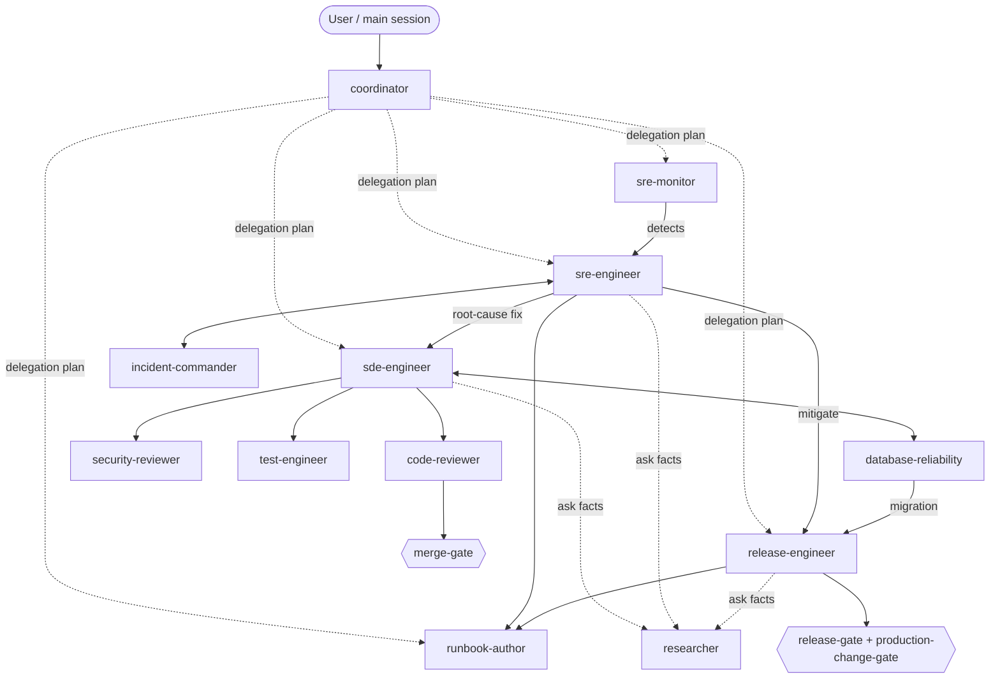

# Architecture

Design rationale + maps for the fleet. The cross-tool usage guide is [AGENTS.md](../AGENTS.md); this
doc explains *why* it's shaped this way. Companion docs: [AGENT-CATALOG.md](AGENT-CATALOG.md) (a
paragraph per agent) and [HANDOFFS.md](HANDOFFS.md) (the fleet-wide handoff map).

## Design principles
1. **Agents are *who*, skills are *how*.** Thin, single-lane agents; reusable `SKILL.md` skills carry the
   procedures and stack knowledge, loaded on demand (progressive disclosure) so context stays cheap.
2. **Seniority/experience = skills, not agents.** One `sde-engineer` + one `sre-engineer` scale altitude
   by loading a *ladder* skill (senior/principal/distinguished; responder/investigator/elite) — no agent
   sprawl and no need to guess the level before routing.
3. **Graded autonomy (propose → execute).** Read-only agents *recommend*; writer agents produce diffs;
   **production-facing execution always needs a human + the `production-change-gate`.**
4. **Least privilege, enforced.** Read-only agents have no Edit/Write; in Claude Code, the ones that keep Bash for
   observation run a `PreToolUse` guard ([../scripts/readonly-guard.py](../scripts/readonly-guard.py))
   that blocks state-changing shell commands. Generated Copilot agents omit terminal access for read-only
   roles because Claude hooks are not portable.
5. **Portable by construction.** One source under `.claude/`, read by Claude Code *and* VS Code/Copilot;
   `AGENTS.md` for other tools; a generator emits Copilot-native `.github/` files.
6. **Stack-fit over generic.** Everything targets on-prem + PCF/TAS (no k8s), Python/Bash/PowerShell, and
   Splunk / Grafana / Wavefront / Moogsoft / ThousandEyes + GitHub Actions.

## Roster (model · mutates? · guard)
| Agent | Lane | Model | Mutates? | Read-only guard |
|---|---|---|---|---|
| coordinator | route → plan | sonnet | no | n/a (no Bash) |
| sde-engineer | build/refactor/fix code | opus | code | — |
| database-reliability | DB migrations, query perf, durability | opus | migration files (never prod DB) | — |
| code-reviewer | correctness/quality review | opus | no | ✅ |
| security-reviewer | security review | opus | no | ✅ |
| test-engineer | tests / coverage | sonnet | tests | — |
| sre-engineer | detect / triage / RCA | opus | no | ✅ |
| sre-monitor | dashboards / SLOs / alerts | sonnet | obs-as-code | — |
| incident-commander | incident process / comms | sonnet | no | ✅ |
| release-engineer | CI/CD + PCF deploy | sonnet | infra/CI (prod = gated) | — |
| runbook-author | runbooks | sonnet | docs | — |
| researcher | cited fact-finding | sonnet | no | n/a (no Bash) |

## Handoff map

## Gates (workflow control)
`merge-gate` before merge; `release-gate` + `production-change-gate` before any prod change. Portable
checklists by default; hardenable via GitHub branch protection / environment reviewers, or Claude Code
`PreToolUse` hooks. See [AGENTS.md](../AGENTS.md#routing--gates-selectors-that-control-the-workflow).

## Provenance
Definitions were authored in-session and then **hardened against three prior agent branches**
(`claude/elite-agent-architecture`, `claude/great-shannon`, `claude/vscode-sre-sde-agents`) — see
[RESEARCH.md](RESEARCH.md) for sources and what was verified vs. dropped.
