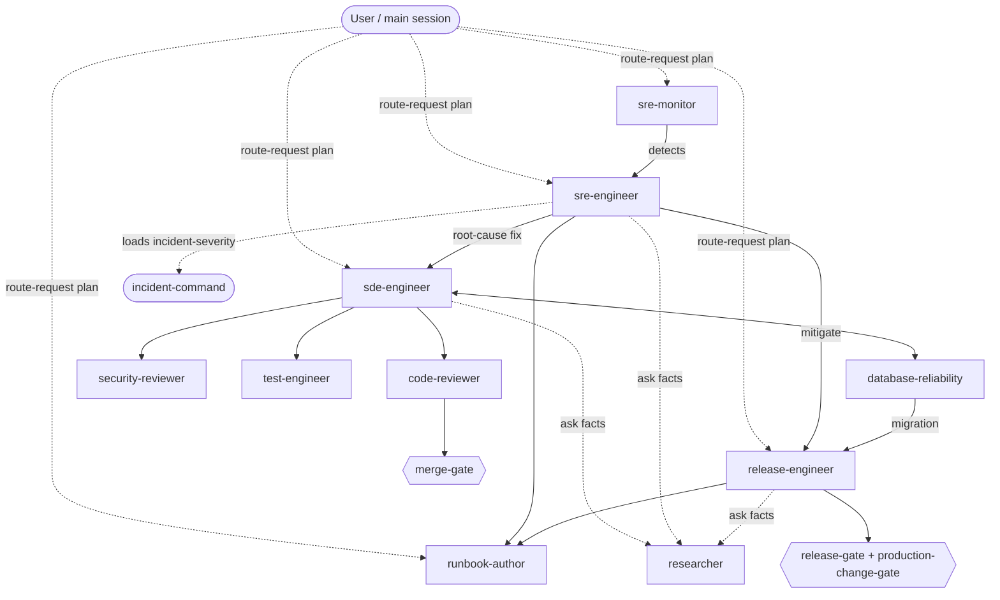

# Architecture

Design rationale + maps for the fleet. The cross-tool usage guide is [AGENTS.md](../AGENTS.md); this
doc explains *why* it's shaped this way. Companion docs: [AGENT-CATALOG.md](AGENT-CATALOG.md) (a
paragraph per agent) and [HANDOFFS.md](HANDOFFS.md) (the fleet-wide handoff map). Deferred strategic work
surfaced by review is tracked in [FOLLOWUPS.md](FOLLOWUPS.md).

## Design principles
1. **Agents are *who*, skills are *how*.** Thin, single-lane agents; reusable `SKILL.md` skills carry the
   procedures and stack knowledge, loaded on demand (progressive disclosure) so context stays cheap.
2. **Seniority/experience = skills, not agents.** One `sde-engineer` + one `sre-engineer` scale altitude
   by loading a *ladder* skill (senior/principal/distinguished; responder/investigator/elite) — no agent
   sprawl and no need to guess the level before routing. The same logic demotes **orchestration** to
   skills: routing (`route-request`) and incident-command (`incident-severity`) run in the main session,
   because a coordinator *subagent* would double-pay the routing round-trip and discard the main session's
   live context the work actually needs — true even now that nested subagent dispatch exists (see
   [adr/0001](adr/0001-routing-and-incident-command-as-skills.md)).
3. **Graded autonomy (propose → execute).** Read-only agents *recommend*; writer agents produce diffs;
   **production-facing execution always needs a human + the `production-change-gate`.**
4. **Least privilege (defense-in-depth, not a sandbox).** Read-only agents have no Edit/Write. In Claude
   Code, the ones that keep Bash for observation run a `PreToolUse` guard
   ([../scripts/readonly-guard.py](../scripts/readonly-guard.py)) that blocks **common** state-changing
   and egress verbs for a *cooperative* agent — it raises the bar and leaves an audit trail, but a
   denylist over a shell is not a security boundary and a novel command can evade it. **The load-bearing
   control is OS-level least-privilege credentials + an outbound allowlist** at the host/network layer;
   the guard is a fast speed-bump on top of that. Generated Copilot agents omit terminal access for
   read-only roles because Claude hooks are not portable.
5. **Portable by construction.** One source under `.claude/`, read by Claude Code *and* VS Code/Copilot;
   `AGENTS.md` for other tools; a generator emits Copilot-native `.github/` files.
6. **Stack-fit over generic.** Everything targets on-prem + PCF/TAS (no k8s), Python/Bash/PowerShell, and
   Splunk / Grafana / Wavefront / Moogsoft / ThousandEyes + GitHub Actions.

## When is something an agent vs. a skill?
**Decision rule:** an **agent** exists when it needs a **distinct tool-scope**, a **distinct guard
posture**, **OR** is a **recurring, separable domain lane with its own handoff edges**; everything else is
a **skill**. (The first two are mechanical, enforced by the harness; the third is editorial — a lane worth
routing to on its own.) Example: `database-reliability` is the **lane** case. Its tool-scope is *not*
distinct — its frontmatter `tools:` (`Read, Write, Edit, Grep, Glob, Bash, TodoWrite`) is byte-identical to
`test-engineer`'s and a subset of `sde-engineer`'s — and there is no read-only `PreToolUse` guard on it. What
makes it an agent is that it's a recurring DBRE domain with its own handoff edges (← `sde-engineer`,
→ `release-engineer`, `sre-engineer`, `sre-monitor`). Its critical prohibition — **never write to a
production DB** — is *not* carried by tool-scoping (the tools allow writes); it is **behavioral** (stated in
the agent body and `description`) and **gate-enforced** (forward + rollback scripts hand off to
`release-engineer` under the `production-change-gate`). Seniority tiers, by contrast, share their agent's
tool-scope *and* its lane, so they are ladder *skills*, not cloned agents. This turns the looser "altitude
vs. lane" intuition into a usable test without overclaiming a tool-scope difference that isn't there. **The
agent and its same-named skill are intentionally paired, not a collision:** the **agent is the lane** (who,
with what handoff edges) and the **skill is the method** (the engine-specific playbook the agent loads).
`database-reliability` is both on purpose.

## The `skills:` frontmatter convention
Only some agents declare a `skills:` block, and that is by design. When present, `skills:` lists the
agent's **single PRIMARY skill** for discoverability (e.g. `code-reviewer → merge-gate`,
`test-engineer → tdd-workflow`, `runbook-author → runbook-template`,
`database-reliability → database-reliability`). It is **not** an exhaustive preload list: agents pick up
the rest of their skills via **description-based auto-load** at runtime, so an absent or single-entry
`skills:` block is expected — not a gap. (This field is Claude-only; the Copilot generator drops it.)

## Skill discoverability budget (required Claude setting)
The fleet ships 38 skills. For Claude Code to surface them for auto-load, [`.claude/settings.json`](../.claude/settings.json)
sets **`skillListingBudgetFraction: 0.04`** — 4× the 1% default — so the skill listing isn't truncated.
This is a **required setting** for the fleet to work as designed; without it, later skills fall off the
listing and stop auto-loading. Two caveats: (1) it does **not** travel to VS Code/Copilot (Copilot has no
equivalent and reads skills its own way), so this tuning is Claude-specific; (2) for small-context
deployments where 4% is still too much, fall back to **`skillOverrides: name-only`** to list skills by
name only (cheaper than full descriptions) rather than dropping the budget back down.

## Roster (model · mutates? · guard)
| Agent | Lane | Model | Mutates? | Read-only guard |
|---|---|---|---|---|
| sde-engineer | build/refactor/fix code | opus | code | — |
| database-reliability | DB migrations, query perf, durability | opus | migration files (never prod DB) | — |
| code-reviewer | correctness/quality review | opus | no | ✅ |
| security-reviewer | security review | opus | no | ✅ |
| test-engineer | tests / coverage | sonnet | tests | — |
| sre-engineer | detect / triage / RCA | opus | no | ✅ |
| sre-monitor | dashboards / SLOs / alerts | sonnet | obs-as-code | — |
| release-engineer | CI/CD + PCF deploy | sonnet | infra/CI (prod = gated) | — |
| runbook-author | runbooks | sonnet | docs | — |
| researcher | cited fact-finding | sonnet | no | n/a (no Bash) |

## Handoff map

## Gates (workflow control)
`merge-gate` before merge; `release-gate` + `production-change-gate` before any prod change. The gates
are portable Markdown checklists. **The real enforcement for prod changes is GitHub branch protection +
protected environments** (the fleet's own `github-actions-ci` pattern — required reviews, required status
checks, environment reviewers with human sign-off): that is the security boundary, and it does not depend
on any agent cooperating. As an *auditable speed-bump* in Claude Code, `release-engineer` additionally
runs a `PreToolUse` hook ([../scripts/production-change-guard.py](../scripts/production-change-guard.py))
that blocks state-changing `cf` commands unless the gate sentinel (`PCF_GATE_CLEARED=1` or a
`.gate-cleared` file) is set — a checklist-forcing convenience for a cooperative agent, **not** a security
control. See [AGENTS.md](../AGENTS.md#routing--gates-selectors-that-control-the-workflow).

## Provenance
Definitions were authored in-session and then **hardened against three prior agent branches**
(`claude/elite-agent-architecture`, `claude/great-shannon`, `claude/vscode-sre-sde-agents`) — see
[RESEARCH.md](RESEARCH.md) for sources and what was verified vs. dropped.
